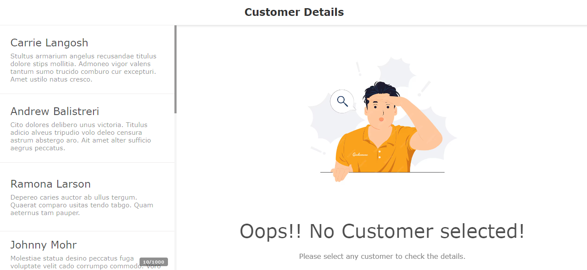
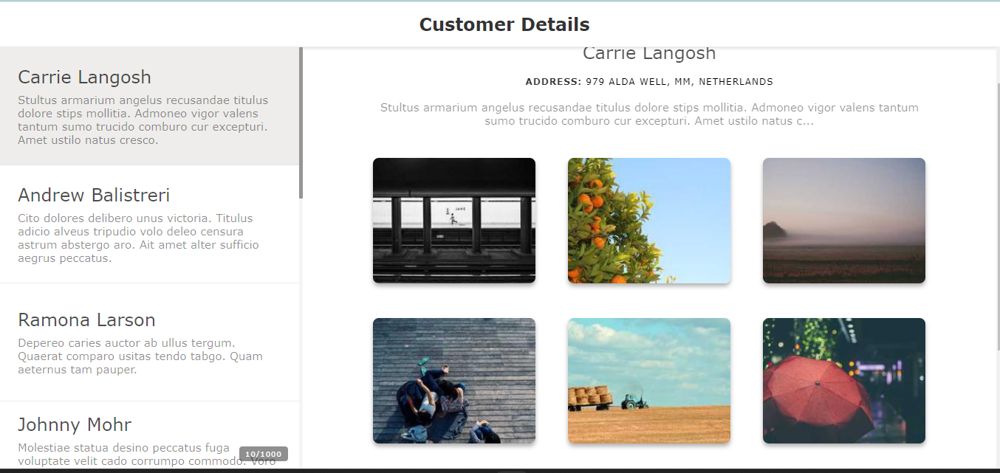

# Cube Frontend Developer Assignment
## Customer Details Portal

## Overview

This is a SPA developed using React and TypeScript that displays a customer details portal.The application includes a list of customers and their details, with features designed to enhance user experience and performance.


## Features

- **Customer List**: Displays a list of customers on the left side of the screen. Each card in the list shows the customer’s name and title.
- **Customer Details**: Clicking on a customer card displays detailed information about the customer on the right side, including:
  - Name
  - Title
  - Address
  - A 3x3 grid of 9 photos

- **Dynamic Photo Grid**: Photos in the 3x3 grid gets updated after every 10 seconds.Photos are fetched from a public API-fakerjs.
- **Performance Optimization**: Performance optimization techniques like debouncing and memoization have been applied for optimal performance

## Technologies Used

- **React**: For building the user interface.
- **TypeScript**: For static type checking and improved development experience.
- **CSS**: For styling and layout.
- **Faker Public API**: For fetching dynamic photos & Dummy Data.

## Deployment

The project is deployed on Vercel and can be accessed using the following link:

(https://cubehq-assignment-rosy.vercel.app/)

## Demo Video Here👇
[](https://vimeo.com/988366100)

## Snapshots
#### Initial No Customer Selected Page


#### Customer Details Page


## Installation

To run this project locally, follow these steps:

1. **Clone the repository:**
    ```bash
    git clone https://github.com/Keegan-20/cubehq-assignment
    ```

2. **Navigate to the project directory:**
    ```bash
    cd your-repository
    ```

3. **Install the dependencies:**
    ```bash
    npm install
    ```

4. **Run the application:**
    ```bash
    npm run dev
    ```


**Thank you for the opportunity!**